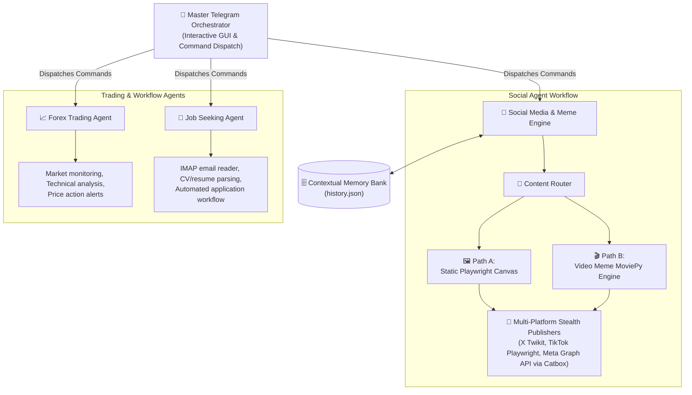
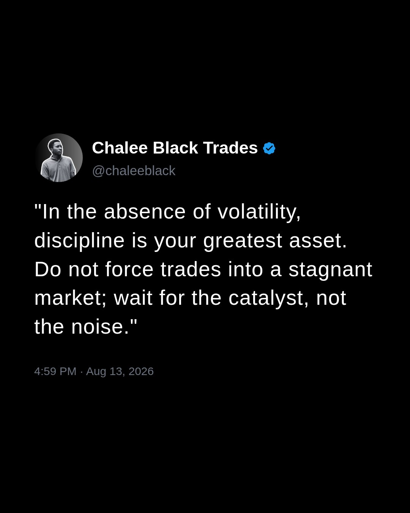

<div align="center">


# CHRONOS

**The Autonomous, Zero-Cost ($0.00 Overhead) Multi-Agent Operating System**


</div>

---

## 🌟 Project Vision & Executive Summary

Chronos is a modular, autonomous multi-agent operating system designed to automate complex, real-world workflows without the burden of monthly SaaS fees or paid API subscriptions. It acts as a fully autonomous digital employee, running seamlessly in the background.

**The Core Philosophy:**
**Intelligent Brains (LLMs) + Autonomous Hands (Playwright/Scrapers) + Human-in-the-Loop (Telegram Orchestrator)**

Chronos leverages Gemini's reasoning engine alongside headless stealth automation tools to orchestrate market analysis, multi-platform media production, viral video generation, and workflow automations entirely for free.

---

## 🏗️ Complete Multi-Agent Architecture

The ecosystem relies on an interactive orchestration layer that delegates instructions to specific agent pipelines while maintaining centralized memory logic.



---

## 🛠️ Granular Sub-Agent Technical Breakdown

### 1. Master Telegram GUI Orchestrator
The central nerve center of Chronos (`orchestrator/telegram_orchestrator.py`).
- **Interactive Draft Review:** All agents compile JSON drafts (quotes, captions, overlays). The Orchestrator presents these drafts via inline keyboards allowing the user to `✅ Approve`, `✏️ Edit`, or `🔄 Reject` before publishing.
- **Manual Generation:** Supports manual ingestion of photos and custom video content, processing them through the agentic tagging pipeline.
- **On-the-Fly Downloader:** Features a `/clip [url] [start] [end]` command utilizing `yt-dlp` to download or clip videos directly from chat into the local templates directory.

### 2. Social Media & Autonomous Media Engine
An advanced content creation suite designed to emulate an authentic human influencer.
- **Static Graphic Engine:** Generates Gemini persona-driven quotes, populates a Tailwind HTML template, and renders a 1080x1350 Canva-style canvas using headless Playwright.
- **Video Meme Engine:** Combines `yt-dlp` downloaded templates with `moviepy` vertical (9:16) composite rendering. Overlays dynamic HTML-rendered meme cards and synchronizes viral hashtags (`#forextrading`, `#tradingmemes`, `#fyp`).
- **Zero-Cost Stealth Publishing:** Completely bypasses standard API rate limits and paywalls:
  - Cookie injection for X (Twitter) via Twikit (`state.json`).
  - Headless browser uploads for TikTok (`tiktok_state.json`).
  - Direct Meta Graph API integration (handling chunked FB uploads and Catbox temporary cloud hosting for Instagram Reels container processing).
- **Dynamic Memory Engine:** Maintains a circular 50-quote buffer (`history.json`) mapping caption start-phrases and tracking emotional filters (`panic`, `celebration`) to prevent duplicate posting and maintain contextual narrative.

### 3. Forex Trading Sub-Agent (WIP)
A dedicated financial agent monitoring raw market data.
- **Monitoring & Alerts:** Evaluates technical setups, parses economic calendars, and feeds real-time price action sentiment back into the Social Agent for cohesive content.

### 4. Job Seeking & Productivity Sub-Agent (WIP)
An automated career manager.
- **Workflow Automation:** Integrates IMAP email reading for interview invites, handles automated CV parsing, and maps applicant pipelines without human intervention.

---

## 📸 Interactive Visual Showcase

<table>
  <tr>
    <td align="center" width="50%">
      <h3>Dynamic Static Quote Canvas</h3>
      <p><em>Playwright 1080x1350 Canva-style rendering</em></p>
      
    </td>
    <td align="center" width="50%">
      <h3>Viral Video Reel Meme</h3>
      <p><em>MoviePy 9:16 vertical video + HTML text-card composite</em></p>
      
    </td>
  </tr>
</table>

---

## ⚙️ Technical Specs & Configuration

<details>
<summary><b>🛠️ Environment Variables Configuration (.env.example)</b></summary>
<br>
Create a <code>.env</code> file in the root directory and populate it:

```env
# Google Gemini SDK (Supports Key Rotation)
GEMINI_API_KEY_1="your_gemini_api_key_here"
GEMINI_API_KEY_2="your_backup_gemini_api_key_here"

# X (Twitter) Fallback Login
X_USERNAME="your_x_username"
X_PASSWORD="your_x_password"

# Meta Graph API (Facebook & Instagram)
FB_PAGE_ID="your_facebook_page_id"
IG_USER_ID="your_instagram_user_id"
META_PAGE_ACCESS_TOKEN="your_long_lived_meta_access_token"

# Telegram Orchestrator
TELEGRAM_BOT_TOKEN="your_telegram_bot_token"
```
</details>

<details>
<summary><b>🍪 Zero-Cost Stealth Cookie Ingestion (state.json & tiktok_state.json)</b></summary>
<br>
To execute stealth API bypasses without triggering bot detections, you must provide exported browser session cookies:

1. Log into X (Twitter) and TikTok on your local browser.
2. Export your session cookies in JSON format (using an extension like EditThisCookie).
3. Place your X cookies at: `agents/social_agent/state/state.json`
4. Place your TikTok cookies at: `agents/social_agent/state/tiktok_state.json`

*(Note: These files are heavily ignored by `.gitignore` to preserve session security.)*
</details>

<details>
<summary><b>🐳 Docker Containerization & Background Daemons</b></summary>
<br>
Chronos is production-ready for 24/7 headless execution. 

```bash
# Build and run the entire ecosystem in detached mode
docker-compose up -d --build
```

The provided `Dockerfile` and `entrypoint.sh` automatically configure the required Linux dependencies for Playwright execution and background script loops.
</details>

---

## 💬 Telegram Orchestrator Command Reference

Interact directly with Chronos via the Telegram GUI.

| Command | Functionality |
| :--- | :--- |
| `/start` | Launch the interactive GUI dashboard and access the main agent menu. |
| `/generate_post` | Trigger static persona quote generation & initiate interactive draft review. |
| `/generate_video` | Trigger vertical 9:16 video meme generation & initiate interactive draft review. |
| `/clip [url] [start] [end]` | Automatically download or clip a video segment via `yt-dlp` directly into the templates folder. |
| `/status` | View agent health, multi-platform publishing status, and contextual memory stats. |

*(All generated outputs will first prompt for explicit human approval `✅ Approve & Post` before executing network requests).*

---

## 🚀 Installation & Quickstart Guide

If running locally (without Docker), follow these exact steps:

```bash
# 1. Clone the repository
git clone https://github.com/charleswereangoye/chronos.git
cd chronos

# 2. Setup Virtual Environment
python -m venv .venv
source .venv/bin/activate  # On Windows: .venv\Scripts\activate

# 3. Install Python Dependencies
pip install -r requirements.txt

# 4. Install Playwright Headless Browsers
playwright install chromium

# 5. Launch the Master Orchestrator
python orchestrator/telegram_orchestrator.py
```

---

## 🗺️ Project Roadmap & Future Milestones

**✅ Completed Milestones:**
- [x] Master Telegram Orchestrator & CLI Interface.
- [x] Playwright HTML-to-Image Rendering Engine (High-Res 1080x1350).
- [x] Twikit Stealth X Integration & Meta Graph API (Reels & Feed) Integration.
- [x] TikTok Headless Automation via Playwright.
- [x] Video Meme Generator (MoviePy vertical compositing + `yt-dlp` clipping).
- [x] JSON Contextual Memory & Emotion Tracking (50-item buffer).

**⏳ Pending Modules:**
- [ ] **YouTube Shorts Automation:** Playwright headless login support for YouTube Shorts stealth uploads.
- [ ] **Forex Agent Expansion:** MT4/MT5 webhook integration and explicit TradingView alert parsing.
- [ ] **Job Seeking Agent Complete Pipeline:** Automated IMAP resume matching and Selenium-based auto-apply scripts.
- [ ] **Cloud VPS Daemon Optimization:** Deep optimization for persistent 24/7 autonomous heartbeat execution on low-tier cloud hardware (e.g., AWS EC2 micro).
