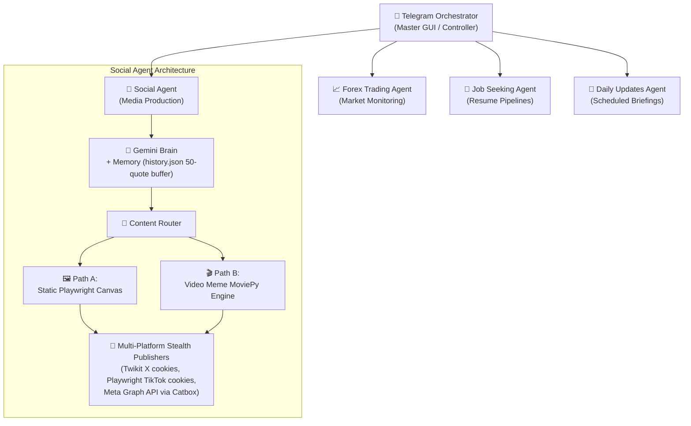

<div align="center">


# ⏳ CHRONOS

**Autonomous, Zero-Cost ($0.00) Multi-Agent Operating System & Media Production Engine**


</div>

---

## 🌟 Executive Feature Showcase

<table>
  <tr>
    <td align="center" width="50%">
      <h3>Dynamic Static Quote Canvas</h3>
      <p><em>Playwright 1080x1350 Canva-style rendering</em></p>
      
    </td>
    <td align="center" width="50%">
      <h3>Viral Video Meme & Reel Engine</h3>
      <p><em>MoviePy 9:16 vertical video + HTML text-card composite</em></p>
      
    </td>
  </tr>
</table>

---

## 🧠 System Architecture & Multi-Agent Ecosystem

Chronos replaces monolithic scheduling scripts with a dynamic, LLM-driven orchestration pipeline. At the core is the Master Orchestrator, dispatching tasks to specialized sub-agents.



### Sub-Agent Capabilities
- 📱 **Social Media & Meme Engine:** Responsible for static graphics, short-form video reels generation, contextual memory tracking, and multi-platform stealth publishing.
- 📈 **Forex Trading Agent:** Market monitoring, sentiment analysis, and alert generation.
- 💼 **Job Seeking & Productivity Agent:** Automated email parsing, application pipelines, and productivity tracking.
- 📅 **Daily Updates Agent:** Automated morning/evening briefings and scheduled digests.

---

## ⚙️ Installation & Configuration

Keep your production setup clean. All detailed configuration steps are located below:

<details>
<summary><b>🛠️ Environment Variables Configuration (.env.example)</b></summary>
<br>
Create a <code>.env</code> file in the root directory:

```env
# Google Gemini (Supports key rotation)
GEMINI_API_KEY_1="your_gemini_api_key_here"
GEMINI_API_KEY_2="your_backup_gemini_api_key_here"

# X (Twitter) Fallback Login (Cookies preferred)
X_USERNAME="your_x_username"
X_PASSWORD="your_x_password"

# Meta Graph API Config
FB_PAGE_ID="your_facebook_page_id"
IG_USER_ID="your_instagram_user_id"
META_PAGE_ACCESS_TOKEN="your_long_lived_meta_access_token"

# Telegram Orchestrator
TELEGRAM_BOT_TOKEN="your_telegram_bot_token"
```
</details>

<details>
<summary><b>🍪 Zero-Cost Stealth Cookie Ingestion (state.json & tiktok_state.json)</b></summary>
<br>
For Twikit (X) and Playwright (TikTok) to work without triggering bot protections, you must export your authenticated browser cookies to bypass API paywalls.

- **For X (Twitter):** Export cookies to `agents/social_agent/state/state.json`.
- **For TikTok:** Export cookies to `agents/social_agent/state/tiktok_state.json`.

*Note: Ensure your `.gitignore` is configured to ignore these state files for maximum session security.*
</details>

<details>
<summary><b>🐳 Docker & Headless Playwright Containerization</b></summary>
<br>
Chronos is built to run 24/7 autonomously on a low-tier cloud instance or VPS.

```bash
# Clone the repository
git clone https://github.com/charleswereangoye/chronos.git
cd chronos

# Run via Docker Compose
docker-compose up -d --build
```

If running locally without Docker, ensure Playwright binaries are installed:
```bash
python -m venv .venv
source .venv/bin/activate
pip install -r requirements.txt
playwright install chromium
```
</details>

---

## 🚀 Telegram Bot Command Cheat Sheet

The Master Orchestrator provides a full interactive GUI to manage agent workflows.

| Command | Description |
| :--- | :--- |
| `/start` | Launch GUI dashboard and access the main agent menu. |
| `/generate_post` | Trigger static quote generation & initiate interactive draft review. |
| `/generate_video` | Trigger 9:16 video meme generation & initiate interactive draft review. |
| `/clip [url] [start] [end]` | Auto-clip and ingest video templates via `yt-dlp` directly to the assets directory. |
| `/status` | View agent health, multi-platform publishing status, and memory stats. |

*In-Chat Interactive Workflows:* Once an agent generates a draft, the bot will prompt you to **✅ Approve & Post**, **✏️ Edit**, or **🔄 Reject & Regenerate**. You can also execute custom manual posts natively via chat.

---

## 🗺 Roadmap & Future Modules

**Completed Milestones:**
- [x] Master Telegram Orchestrator & CLI
- [x] Playwright HTML-to-Image Rendering Engine
- [x] Twikit Stealth X Integration
- [x] Meta Graph API (Reels & Feed) via Catbox Temporary Hosting Integration
- [x] TikTok Headless Automation
- [x] Video Meme Generator (MoviePy compositing)
- [x] JSON Contextual Memory & Emotion Tracking (50-quote buffer)

**Pending Modules:**
- [ ] **YouTube Shorts Automation:** Add Playwright/API support for stealth YouTube Shorts uploads.
- [ ] **Forex Agent Expansion:** Full implementation of sentiment analysis and MT4/MT5 webhook integration.
- [ ] **Job Seeking Agent:** IMAP email parsing and automated resume submission workflows.
- [ ] **Cloud VPS Daemon:** Optimize the Docker container for 24/7 autonomous heartbeat execution on low-tier cloud instances.
