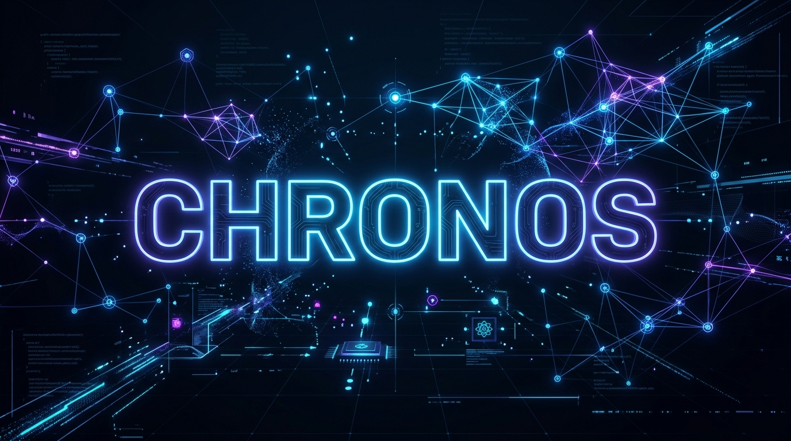
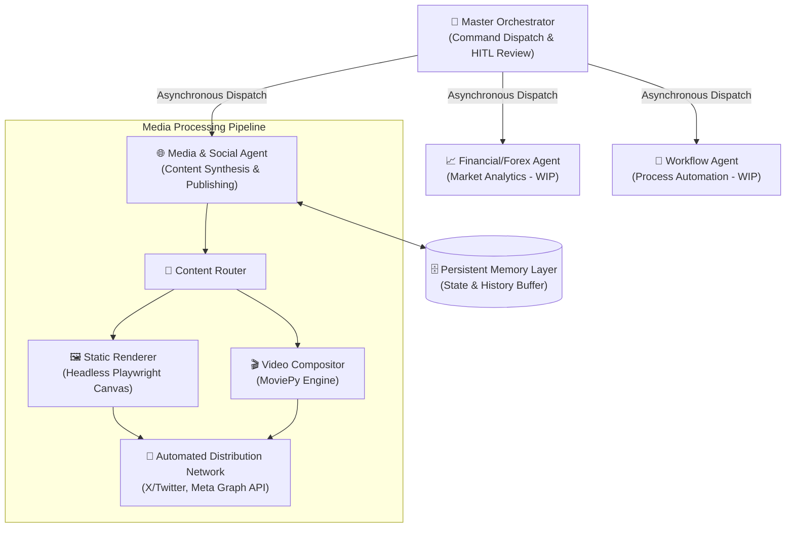

<div align="center">



# Chronos: Autonomous Multi-Agent Operating System

**An Enterprise-Grade, Modular Framework for Scalable Autonomous Workflows**

[](#)
[](#)
[](#)
[](#)
[](#)

</div>

---

## 1. Executive Summary

**Chronos** is an advanced, autonomous multi-agent operating system engineered to execute complex, real-world workflows dynamically. Designed for scalability and resilience, the framework seamlessly integrates Large Language Models (LLMs) with headless browser automation, delivering a highly extensible platform for multi-domain operations. 

By abstracting the orchestration layer from specialized sub-agents, Chronos enables organizations to deploy scalable digital workforce solutions—spanning data analysis, intelligent media distribution, and automated interactions—with near-zero operational overhead.

---

## 2. Core Capabilities

*   **Intelligent Agent Orchestration:** Centralized command dispatch via an interactive Telegram-based GUI, facilitating human-in-the-loop (HITL) approval workflows before execution.
*   **Dynamic Headless Automation:** Integrated Playwright and Twikit engines for sophisticated UI interactions, bypass handling, and seamless content publication across diverse platforms.
*   **Resilient API Management:** Built-in load balancing and API key rotation for Google Gemini SDKs, ensuring high availability and fault tolerance.
*   **Context-Aware Memory Systems:** JSON-backed persistent state management and circular buffering to maintain agent continuity, contextual memory, and state isolation.
*   **Containerized Portability:** Fully dockerized architecture with robust background daemon execution, ready for deployment in modern cloud environments.

---

## 3. System Architecture

The ecosystem relies on an event-driven orchestration layer that securely delegates tasks to specialized agent pipelines while maintaining centralized memory logic.



---

## 4. Sub-Agent Topologies

### 4.1 Master Orchestrator Layer
The central nerve center (`orchestrator/`) managing state and human-in-the-loop (HITL) interactions.
*   **Interactive Review Pipeline:** All agents generate standardized payloads (drafts, configurations, operational metadata). The Orchestrator surfaces these via inline dashboards for human validation (`✅ Approve`, `✏️ Edit`, or `🔄 Reject`) before executing network requests.
*   **Manual & Custom Generation:** Full support for manual text, photo, and custom video posts with explicit prompt states for custom captions and hashtags.
*   **Unified Action Buttons:** Streamlined multi-step background flows into single clicks (e.g., "Tailor CV & Cover Letter" runs parallel web scrapers, LLM agents, and PDF generators concurrently).
*   **Media Ingestion & Processing:** Native support for URL parsing, segmented video clipping via `yt-dlp` (e.g., `/clip [url] [start] [end]`), and asset routing to the appropriate agent template directories.

### 4.2 Media & Social Operations Agent
An autonomous media synthesis and distribution pipeline (`agents/social_agent/`).
*   **Render Engine:** Utilizes headless Playwright to populate HTML/Tailwind templates, generating high-resolution (1080x1350) canvas assets.
*   **Compositing Engine:** Integrates `moviepy` for vertical video synthesis, appending dynamic metadata (e.g., HTML text cards) to segmented base templates.
*   **Distribution Modules:** Manages authenticated session states (`state.json`) and access tokens to interface securely with X (Twikit) and the Meta Graph API.
*   **State Management:** Implements a fixed-size circular buffer to maintain emotional state vectors and prevent repetitive processing.

### 4.3 Analytical & Workflow Agents

#### 4.3.1 Financial Analytics Agent (WIP)
A dedicated financial agent monitoring raw market data.
*   **Monitoring & Alerts:** Evaluates technical setups, parses economic calendars, and feeds real-time price action sentiment back into the Social Agent for cohesive content.

#### 4.3.2 Job Seeking & Productivity Agent
An automated career manager that acts as your personal job-seeking proxy.
*   **Profile Synthesizer:** Scrapes and merges your GitHub, LinkedIn, and base Resume into a master JSON profile using Gemini.
*   **Automated CV & Cover Letter Tailoring:** Uses Playwright to scrape a target job description URL, deeply analyzes the requirements, and instantly tailors your CV and Cover Letter to match.
*   **Dynamic Formatting:** Generates premium, ATS-friendly PDFs using headless HTML rendering, automatically pulling the target company's brand color (with luminance-safety checks) and naming the files dynamically.

---

## 5. Technical Specifications & Setup

### 5.1 System Requirements
*   Python 3.11 or higher
*   Docker & Docker Compose (for containerized deployments)
*   Playwright dependencies

### 5.2 Environment Configuration
System configuration relies on environment variables. Create a `.env` file in the project root:

```env
# AI Model Configuration (Supports Key Rotation & Load Balancing)
GEMINI_API_KEY_1="primary_api_key"
GEMINI_API_KEY_2="secondary_api_key"

# Authentication Credentials
X_USERNAME="service_account_username"
X_PASSWORD="service_account_password"

# API Integration Tokens
FB_PAGE_ID="meta_page_id"
IG_USER_ID="meta_ig_user_id"
META_PAGE_ACCESS_TOKEN="long_lived_access_token"

# Orchestrator Configuration
TELEGRAM_BOT_TOKEN="secure_bot_token"
```

### 5.3 Local Development Setup

```bash
# 1. Clone the repository
git clone https://github.com/charleswereangoye/chronos.git
cd chronos

# 2. Initialize the Python Virtual Environment
python -m venv .venv
source .venv/bin/activate  # Windows: .venv\Scripts\activate

# 3. Install Core Dependencies
pip install -r requirements.txt

# 4. Initialize Headless Browsers
playwright install chromium

# 5. Launch the Orchestrator
python orchestrator/telegram_orchestrator.py
```

### 5.4 Dockerized Deployment

For robust, persistent execution in production environments:

```bash
# Build the images and start the daemon services
docker-compose up -d --build

# Monitor operational logs
docker-compose logs -f chronos_bot
```

### 5.5 Session State Management
To enable secure distribution network bypasses without exposing raw credentials:
1. Export active browser session cookies in standard JSON format.
2. Deploy the cookie manifest to the secured state directory: `agents/social_agent/state/state.json`.

---

## 6. Testing & Quality Assurance

Chronos maintains a robust test suite to validate core workflows and API integrations. Ensure the virtual environment is active before running tests.

```bash
# Execute unit and integration tests
pytest test_*.py -v
```

---

## 7. License and Governance

This project is licensed under the **MIT License**. See the `LICENSE` file for full details. 

## 8. Project Roadmap & Future Milestones

**⏳ Pending Modules:**
*   [ ] **YouTube Shorts Automation:** Playwright headless login support for YouTube Shorts stealth uploads.
*   [ ] **Forex Agent Expansion:** MT4/MT5 webhook integration and explicit TradingView alert parsing.
*   [x] **Job Seeking Agent CV Tailoring:** Fully autonomous profile synthesis and ATS-optimized document generation.
*   [ ] **Job Seeking Agent Auto-Apply:** Selenium-based auto-apply scripts and IMAP interview matching.
*   [ ] **Cloud VPS Daemon Optimization:** Deep optimization for persistent 24/7 autonomous heartbeat execution on low-tier cloud hardware.

---

*Designed and engineered for scalability, security, and continuous autonomous operation.*
